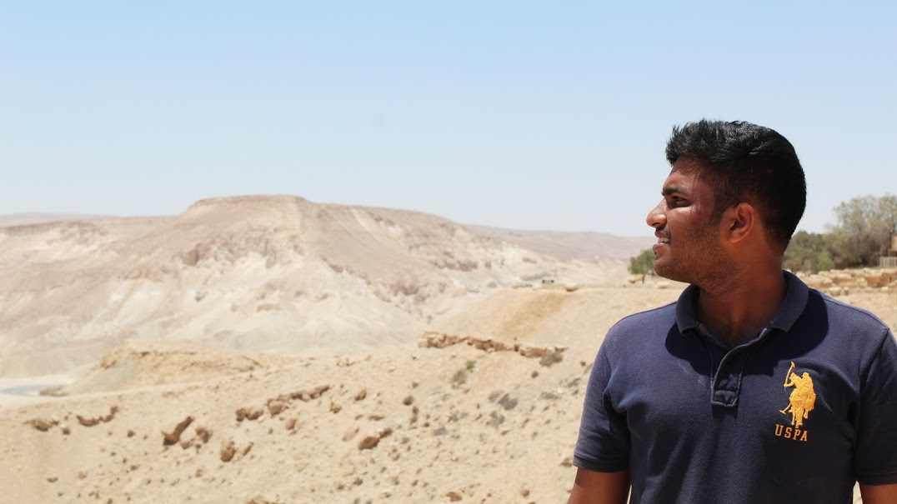
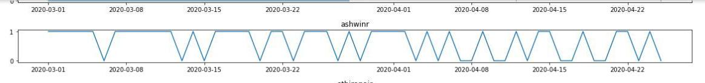
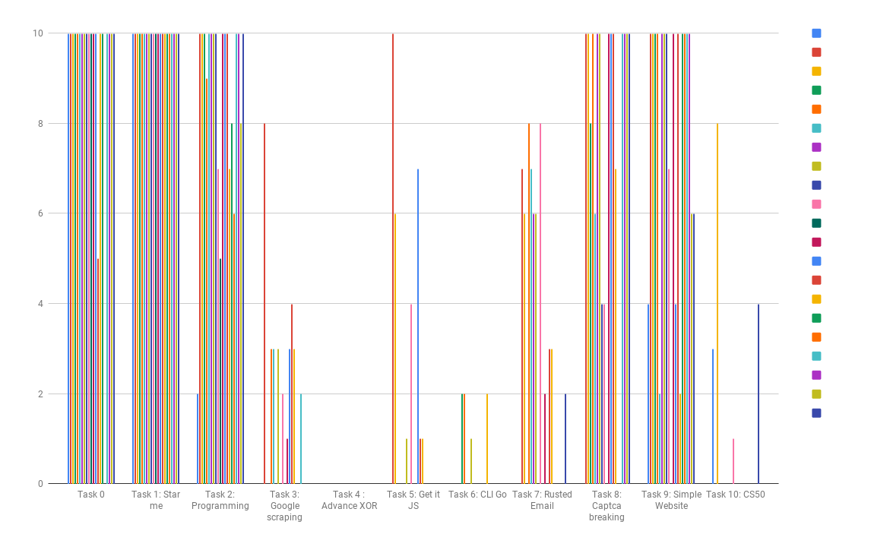

My Name is Venu Vardhan Reddy Tekula.

I am currently a Student Developer working on GrimoireLab with 
[CHAOSS](https://chaoss.community/), a Linux Foundation Project and 
[Bitergia](https://bitergia.com/) under the [Google Summer of Code](https://summerofcode.withgoogle.com/) Program.

I almost completed my undergraduate studies (yet to be graduted ^^). I finished my Bachelors in CSE at [Amrita Vishwa Vidyapeetham](https://www.amrita.edu/), Kollam. I am also a member of [amFOSS](https://amfoss.in/), the Open Source club of Amrita. I mentor students and help them to pull up their first contribution to Open Source. I can teach them the difference between Git and GitHub.

I like to travel and cook. I usually play with data, plot graphs with them and show the results to people. 🕵️‍♂️

The below plot is the status update trend of [Ashwin R](https://ashwinkey04.github.io/). 🧐

The below plot explains the distribution of scores for the tasks, completed by the freshers to join the amFOSS club. 😲

My area of interests are Data Analytics, Cyber Security and Machine Learning. I mostly work with Python. Here is my Curriculum Vitae for reference, [CV-Venu](https://vchrombie.github.io/docs/cv.pdf).

I usually share my work on this site and put my views (not much ranting but sometimes puns and sarcasm) on my [twitter](https://twitter.com/vchrombie). 👇

<a class="twitter-timeline"
  href="https://twitter.com/vchrombie"
  data-width="360"
  data-height="540">
Tweets by @vchrombie
</a>