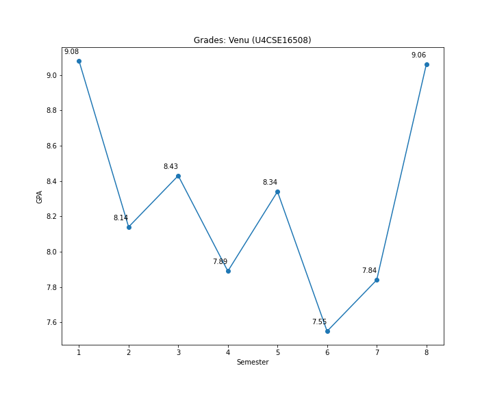
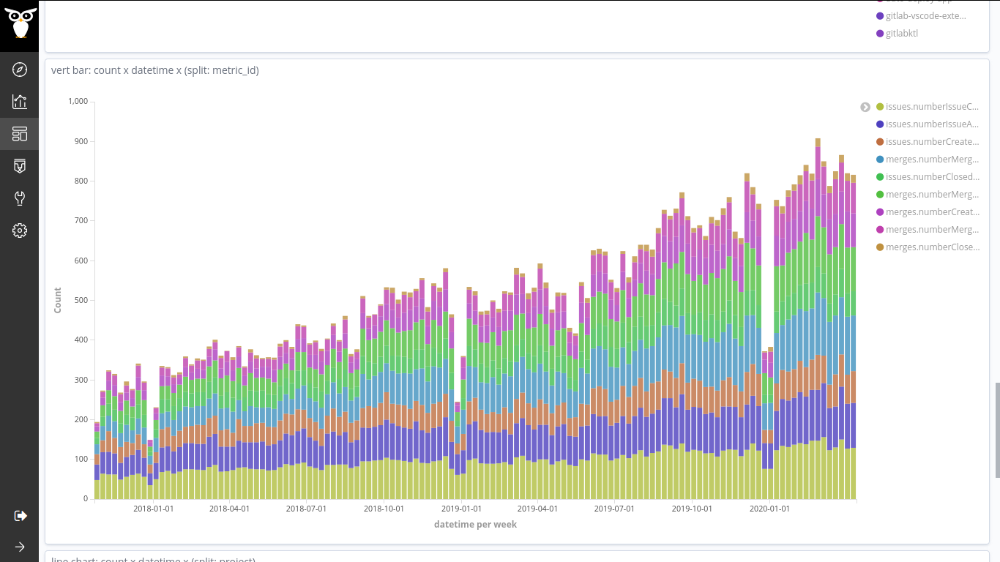
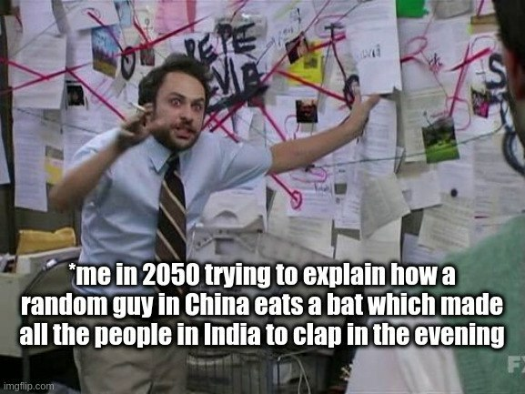
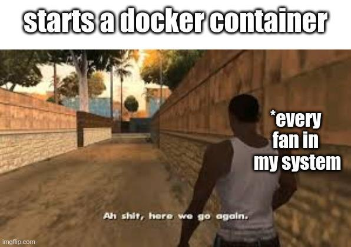
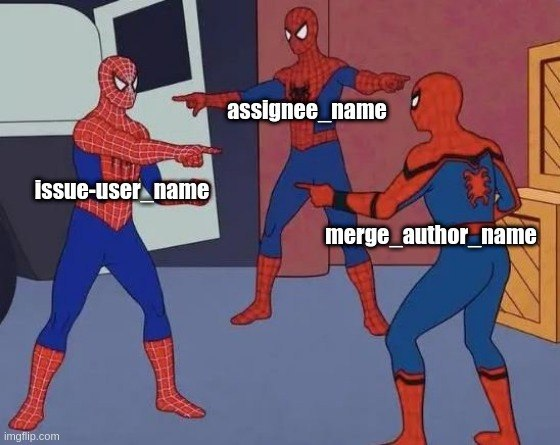

## Articles

- [The secrets to onboarding new open source contributors](https://github.com/readme/featured/contributor-onboarding)
- [NSE freezes due to technical glitch. Twitter gets best memes and jokes - India Today](https://www.indiatoday.in/trending-news/story/nse-freezes-due-to-technical-glitch-twitter-gets-best-memes-and-jokes-1772476-2021-02-24)
- [Meet the new Bitergians: Eva and Venu - Bitergia](https://bitergia.com/blog/bitergia/meet-the-new-bitergians-eva-and-venu/)

## Podcasts

- [CHAOSScast Episode 21: GSOC Pt. 2: Extending GrimoireLab projects with Ria and Venu](https://podcast.chaoss.community/21)
- [CHAOSScast Episode 47: Writing the GrimoireLab Tutorial through the Summer of Open Source Promotion Plan with Veerasamy Sevagen](https://podcast.chaoss.community/47)

## Random

### plots

undergrad grades

gitlab commits vs christmas

### memes

automation ftw!

butterfly effect

docker on 4gb ram

grimoirelab joke

### tweets

<blockquote class="twitter-tweet">
created a url shortener that works with github pages, check this<a href="https://t.co/iAXfaDpLKG">https://t.co/iAXfaDpLKG</a>
&mdash; Venu Vardhan Reddy Tekula (@vchrombie) <a href="https://twitter.com/vchrombie/status/1603595098905796611?ref_src=twsrc%5Etfw">December 16, 2022</a></blockquote>

<blockquote class="twitter-tweet">
need to appreciate the efforts put by the developers of <a href="https://twitter.com/gitlab?ref_src=twsrc%5Etfw">@gitlab</a>, for the exponential growth in the activities of their projects. 👏<a href="https://twitter.com/Bitergia?ref_src=twsrc%5Etfw">@Bitergia</a> <a href="https://t.co/YUKHrviEZn">pic.twitter.com/YUKHrviEZn</a>
&mdash; Venu Vardhan Reddy Tekula (@vchrombie) <a href="https://twitter.com/vchrombie/status/1290775534922690560?ref_src=twsrc%5Etfw">August 4, 2020</a></blockquote>

<blockquote class="twitter-tweet">
Are you a loop? Because I can’t stop thinking about you.
&mdash; Venu Vardhan Reddy Tekula (@vchrombie) <a href="https://twitter.com/vchrombie/status/1603027088264794114?ref_src=twsrc%5Etfw">December 14, 2022</a></blockquote>

<blockquote class="twitter-tweet">
i wasn&#39;t ready for this level of adulthood
&mdash; Venu Vardhan Reddy Tekula (@vchrombie) <a href="https://twitter.com/vchrombie/status/1666559792955924480?ref_src=twsrc%5Etfw">June 7, 2023</a></blockquote>
