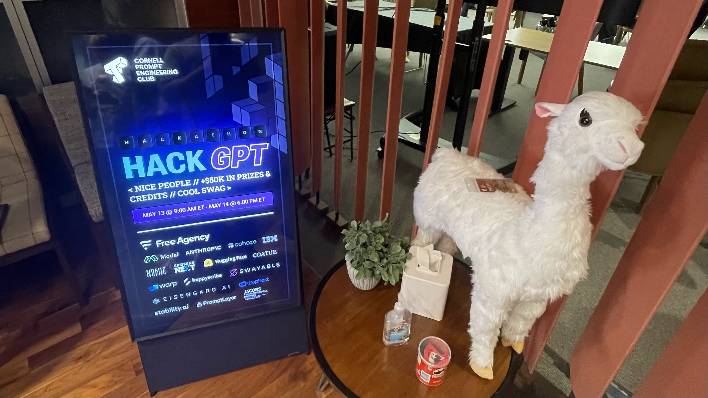

Hello there, LTNS!

Recently, I participated in [HackGPT](https://partiful.com/e/WjEpaOg8x6JwdKhHlNXL), a hackathon specifically designed for students who are passionate about exploring the fascinating world of large language models (LLMs). This event was a perfect blend of coding sprints, learning new technologies, networking, and loads of fun.

The day finally came, and I couldn't have been more excited. Armed with a coffee, my laptop, and a plethora of ideas, I dove headfirst into the vibrant atmosphere of the hackathon.

One of the most striking things about the hackathon was the tangible energy and excitement. Everyone was ready to delve into the world of LLMs, eager to exchange ideas and insights.

Then, we formed our teams. This step was crucial, as a balanced blend of skills and personalities was key to navigating the challenges ahead. I was lucky to find myself in a team of diverse but compatible individuals. Our shared passion for technology and problem-solving brought us together and we soon became more than just teammates.

Once teams were formed, the coding marathon began. And boy, was it intense! The hours blurred together as we brainstormed, coded, debugged, and learned new frameworks on the go. The high-pressure environment was a test of our endurance and creativity, but we were all too thrilled to mind.

During this phase, we conceptualized and developed VisaGPT. VisaGPT is a tool that leverages the power of LLMs to facilitate the visa application process. We built it with the goal of making the often arduous task of visa applications more streamlined and intuitive.

|  |  |
| --- | --- |
|  |  |

Despite the pressure, the sense of camaraderie was heartwarming. The hackathon was not just about innovating and coding. It was also about shared laughter over an unexpected bug, support during tricky debugging sessions, and the collective joy of bringing our idea to life. There was a lot of food, snacks and coffee to keep us going, and the organizers were always available to help us out.

|  |  |  |
| --- | --- | --- |
|  |  |  |

The HackGPT experience was a true testament to the power of collaboration and innovation. It wasn't just about learning new technologies or creating a project under time constraints. It was about the collective spirit, passion for technology, and the transformation of an idea into a tangible product.

|  |  |
| --- | --- |
|  |  |
|  |  |

In conclusion, my time at HackGPT was an unforgettable adventure. The skills and insights I've gained and the friendships I've formed are priceless. If you're a student passionate about coding and eager to meet like-minded individuals, I highly recommend participating in the next HackGPT event.

You can find more information about the project
- Devpost: [VisaGPT](https://devpost.com/software/visagpt)
- Repository: [github.com/vchrombie/visagpt](https://github.com/vchrombie/visagpt)
- Demo: [visagpt.streamlit.app](https://visagpt.streamlit.app/) 

Until next time, keep innovating and coding!
