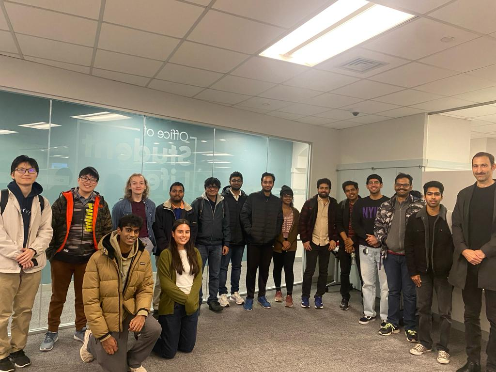

As an active OpenSearch contributor and Masters student at NYU, I have been
working closely with [William Beckler](https://www.linkedin.com/in/thegeneral/)
and [Monica Kugler](https://www.linkedin.com/in/monicavnguyen/) for over a year
to increase OpenSearch visibility on campus through talks, workshops, and more.
This blog post discusses about the events.

I talked with various clubs explaining about OpenSearch and discussing potential
collaborations and events like talks, workshops and coding & contributing
sessions. I invited a couple of club members to the NYC User Group meetings as
well to introduce them to the OpenSearch Community. We met [Daniel
Doubrovkine](https://www.linkedin.com/in/dblock/) and [David
Tippett](https://www.linkedin.com/in/david-tippett/) during these meetings and
talked about more ideas.

We conducted two successful events at New York University in collaboration with
OpenSearch. We had Daniel as the speaker for both the events.

1. BUGS presents... OpenSearch Speaker Event!

https://engage.nyu.edu/event/9579119

https://www.instagram.com/p/CzKvHTAsizR

<blockquote class="twitter-tweet">
Excited to speak about <a href="https://twitter.com/OpenSearchProj?ref_src=twsrc%5Etfw">@OpenSearchProj</a> at BUGS, the <a href="https://twitter.com/nyuniversity?ref_src=twsrc%5Etfw">@nyuniversity</a> open source club, tonight at 5pm!<a href="https://t.co/TrOXNGU8e4">https://t.co/TrOXNGU8e4</a>
&mdash; Daniel (dB.) Doubrovkine (parody of myself) (@dblockdotorg) <a href="https://twitter.com/dblockdotorg/status/1720502520018047083?ref_src=twsrc%5Etfw">November 3, 2023</a></blockquote>

The first event was hosted in partnership with BUGS, NYU's premier open source
club. The main agenda was to introduce OpenSearch, its community, and how
students can get involved.

The event provided background on how OpenSearch started as a fork of
Elasticsearch and evolved into a leading open source search and analytics engine
run by a community of dedicated contributors. Daniel shared insightful stories
highlighting major OpenSearch releases and advancements.

Additionally, we discussed the OpenSearch Contributor Initiative (OSCI) program
as an opportunity for students to make impactful contributions over 3 months.
Multiple students expressed interest in participating in the next cohort
beginning early 2023. Overall, the event sparked further enthusiasm regarding
OpenSearch and open source at the university.

2. NYMLC x OpenSearch Speaker Event

https://engage.nyu.edu/event/9598219

The second collaboration was with the New York Machine Learning Club (NYMLC).
The goal was to explore OpenSearch's extensive machine learning integrations and
use cases.

The discussion focused on cutting edge AI and ML applications within the
OpenSearch suite. Daniel provided unique insights into leveraging OpenSearch for
modern search, visualization, and predictive capabilities. NYU students asked
thoughtful questions and learned how OpenSearch enables impactful machine
learning engineering across many real-world systems.

Overall, students gained valuable exposure to OpenSearch while making
connections to explore further involvement. I believe such campus engagement
will continue to strengthen OpenSearch community growth.

Huge shoutout to [Daniel](https://www.dblock.org) for coming and speaking at the events!
